<h1>Vinicius Ribeiro</h1>

  <h2>
    Saudações 👋  
  </h2>

  

  

    Meu nome é <strong>Vinicius Ribeiro</strong>, sou Engenheiro de Controle e Automação, atuando como Data Engineer e Data Scientist.  
    Atualmente, sou aluno de mestrado no <strong>COPPE</strong>/<strong>UFRJ</strong>, onde foco em projetos de <strong>otimização</strong> e <strong>modelagem</strong>. Tenho experiência em diversos setores, incluindo <strong>bancos</strong>, <strong>telecom</strong>, <strong>varejo</strong> e <strong>cadeia de suprimentos</strong>.
  

  

    Ao longo da minha trajetória, me envolvi em análises e projetos que buscam soluções inovadoras e eficientes para problemas complexos. 
    Também possuo experiência em linguagens de programação como <strong>Java</strong>, <strong>Scala</strong>, <strong>C#</strong>, <strong>C++</strong>, <strong>C</strong> e <strong>Python</strong>.
  

  

    Gosto de explorar diferentes áreas do conhecimento, especialmente aquelas que podem se beneficiar de técnicas de <strong>Machine Learning</strong>, <strong>Inteligência Artificial</strong> ou <strong>Otimização</strong>. 
    Estou sempre aberto a novos desafios e oportunidades de pesquisa e desenvolvimento.
  

 

 

  <h2>
    Hello there 👋  
  </h2>

  <!-- Substitua a imagem abaixo por outra a seu gosto -->
  

  

    My name is <strong>Vinicius Ribeiro</strong>, a Control and Automation Engineer working as a Data Engineer and Data Scientist. 
    Currently, I am pursuing my M.Sc. at <strong>COPPE</strong>/<strong>UFRJ</strong> with a focus on <strong>optimization</strong> and <strong>modeling</strong>. 
    I have worked on projects in <strong>banking</strong>, <strong>telecom</strong>, <strong>retail</strong>, and <strong>supply chain</strong> domains.
  

  

    My professional background involves creating innovative and efficient solutions for complex problems. 
    I am proficient in <strong>Java</strong>, <strong>Scala</strong>, <strong>C#</strong>, <strong>C++</strong>, <strong>C</strong>, and <strong>Python</strong>.
  

  

    I enjoy exploring different fields of knowledge where <strong>Machine Learning</strong>, <strong>Artificial Intelligence</strong>, or <strong>Optimization</strong> techniques could be applied. 
    Always looking for new challenges, research opportunities, and development experiences.
  

 

 

<!-- Badges de linguagens -->

  <h3>Skills & Tools</h3>
  
  
  
  
  
  

